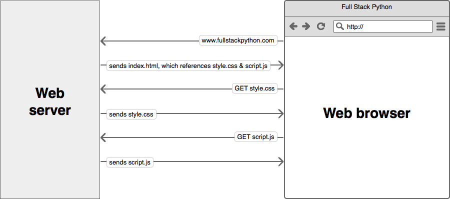
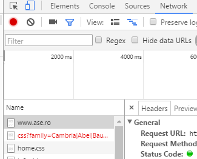
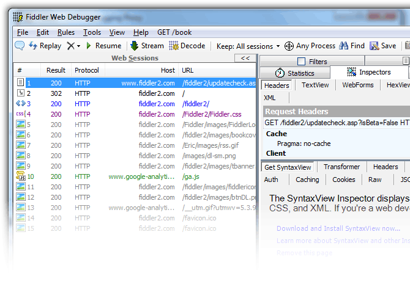

# Introduction

## Did you know?

Using JavaScript, HTML and CSS we can build a **huge** array of application
types.

**Client side web applications**

-   like Gmail

**Server side applications**

-   Node.JS (<https://nodejs.org/en/> )

**Cross-platform desktop applications**

-   Progressive Web Applications, Electron (<https://github.com/electron/electron>). Note: **Microsoft Visual
    Studio Code** is based on Electron

**Mobile applications**

-   Apache Cordova (<https://cordova.apache.org/> )

## HTTP Protocol

-   Hypertext Transfer Protocol (HTTP) is an application-layer protocol for
    transmitting hypermedia documents, such as HTML. It was designed for
    communication between web browsers and web servers, though it can be used
    for other purposes as well.

-   It follows a classical client-server model, with a client opening a
    connection, making a request, and waiting until it receives a response.

    

-   It is also a stateless protocol, meaning that the server does not keep any
    data (state) between two requests. Though often based on a TCP/IP layer, it
    can be used on any reliable transport layer, that is a protocol that don't
    lose messages silently [1].

> Further reading (compulsory): [Mozilla Developer Network - HTTP](https://developer.mozilla.org/en-US/docs/Web/HTTP) 

Activity

1.  Open the Google Chrome browser and navigate to <https://www.wikipedia.org/>

2.  Open the Google Chrome Developer Tools (F12 or from the browser menu)

3.  Open the Sources tab and click on (index). Notice the HTML code.

4.  Open the Network tab. Notice the list of file names. Why do you think we
    have several files listed?

    

5.  Click on one of the requests. Check the Headers tab.

6.  Analyze the HTTP traffic using Fiddler (<http://www.telerik.com/fiddler>).
    In what context we might need to use Fiddler instead of the Network tab in
    the Google Chrome Developer Tools?

>Further reading (compulsory): [Google - Chrome Developer Tools](https://developer.chrome.com/devtools)

## HTML, CSS, JavaScript
-   HTML (HyperText Markup Language)

    -   represents the most basic building block of a webpage and is used for
        creating and visually representing a webpage. It determines the content
        of a webpage, but not its functionality [2].

-   CSS (Cascading Style Sheets)

    -   is stylesheet language used to describe the presentation of a document
        written in HTML or XML (including XML dialects like SVG or XHTML). CSS
        describes how elements should be rendered on screen, on paper, in
        speech, or on other media [3].

-   JavaScript

    -   adds interactivity to the web page;

    -   **lightweight**, interpreted, programming language with first-class
        functions. While it is most well-known as the scripting language for Web
        pages, many non-browser environments also use it, such as node.js and
        Apache CouchDB.

    -   Is a prototype-based, multi-paradigm, dynamic scripting language,
        supporting object-oriented, imperative, and declarative (e.g. functional
        programming) styles. [4].

> Further reading: [first-class functions](https://en.wikipedia.org/wiki/First-class_function), [class-based vs. prototype-based languages](https://developer.mozilla.org/en-US/docs/Web/JavaScript/Guide/Details_of_the_Object_Model#Class-Based_vs._Prototype-Based_Languages) 

## Bibliography
[1] “HTTP,” *Mozilla Developer Network*. [Online]. Available:
https://developer.mozilla.org/en-US/docs/Web/HTTP. [Accessed: 09-Oct-2016].

[2] “HTML,” *Mozilla Developer Network*. [Online]. Available:
https://developer.mozilla.org/en-US/docs/Web/HTML. [Accessed: 09-Oct-2016].

[3] “CSS,” *Mozilla Developer Network*. [Online]. Available:
https://developer.mozilla.org/en-US/docs/Web/CSS. [Accessed: 09-Oct-2016].

[4] “JavaScript,” *Mozilla Developer Network*. [Online]. Available:
https://developer.mozilla.org/en-US/docs/Web/JavaScript. [Accessed:
09-Oct-2016].
