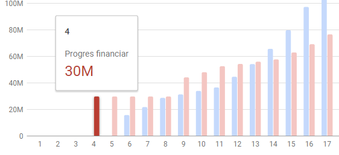

# Scalable Vector Graphics - SVG
<!-- vscode-markdown-toc -->
* 1. [Objectives](#Objectives)
* 2. [What is it?](#Whatisit)
* 3. [Documentation](#Documentation)
* 4. [Assignment (solved)](#Assignmentsolved)
* 5. [Assignment (for you to try)](#Assignmentforyoutotry)
* 6. [Bibliography](#Bibliography)

<!-- vscode-markdown-toc-config
	numbering=true
	autoSave=true
	/vscode-markdown-toc-config -->
<!-- /vscode-markdown-toc -->

##  1. <a name='Objectives'></a>Objectives
- creating an SVG element using JavaScript;
- adding various elements in the SVG and setting their attributes (coordinates, width, height, etc.);
- applying CSS styles to SVG Elements;
- subscribing to the events triggered on the SVG elements.

##  2. <a name='Whatisit'></a>What is it?
**Scalable Vector Graphics (SVG)** is an
[XML](https://developer.mozilla.org/en-US/docs/XML)-based markup language for
describing two-dimensional [vector
graphics](https://en.wikipedia.org/wiki/Vector_graphics). SVG is essentially to
graphics what [HTML](https://developer.mozilla.org/en-US/docs/Web/HTML) is to
text. SVG is similar to Adobe's proprietary Flash technology, but it is a
text-based open Web standard instead of a closed binary format. It is explicitly
designed to work with other web standards such as
[CSS](https://developer.mozilla.org/en-US/docs/CSS),
[DOM](https://developer.mozilla.org/en-US/docs/DOM), and
[SMIL](https://developer.mozilla.org/en-US/docs/Web/SVG/SVG_animation_with_SMIL).

##  3. <a name='Documentation'></a>Documentation

-   SVG: <https://developer.mozilla.org/en/docs/Web/SVG>

##  4. <a name='Assignmentsolved'></a>Assignment (solved)

Let's imagine that we are asked to implement a simple JavaScript **bar chart** library, having the following requirements:
 - anyone should be able to use our library by referencing a **single** `*.js` file;
 - the library should **not** have any dependencies on other libraries (such as: jQuery, D3.js, etc.);
 - the chart should be **interactive** (ex: the bars should change color when the user hovers over them).

>Try the complete `svg-bar-chart` sample by clicking [here](https://ase-multimedia.azurewebsites.net/svg-bar-chart/).


As an example, you can find below the code required for displaying a **bar chart** using the [Google Charts](https://developers.google.com/chart/interactive/docs/gallery/barchart) library:

**HTML**
```HTML
  <script src="https://www.gstatic.com/charts/loader.js"></script>

  <div id="chart_div"></div>
```
**JavaScript**
```JavaScript
google.charts.load('current', {packages: ['corechart', 'bar']});
google.charts.setOnLoadCallback(drawBasic);

function drawBasic() {
    var data = google.visualization.arrayToDataTable([
        ['City', '2010 Population',],
        ['New York City', 8175000],
        ['Los Angeles', 3792000],
        ]);

    var options = {
        title: 'Population of Largest U.S. Cities',
        hAxis: {
            title: 'Total Population',
            minValue: 0
        },
        vAxis: {
            title: 'City'
        }
    };
}

var chart = new google.visualization.BarChart(document.getElementById('chart_div'));
chart.draw(data, options);
```

1. Add an `HTML` file called `index.html` and add the code included below.

    ```HTML
    <!DOCTYPE HTML>
    <html>

    <head>
        <title>SVG Bar Chart</title>
        <meta name="viewport" content="width=device-width, initial-scale=1, maximum-scale=1.0, user-scalable=0">
    </head>

    <body>
        <div id="barChart" style="height:300px"></div>
    </body>

    </html>
    ```

2. Similar to the Google Charts library, we would want to use our bar chart library as follows. Add the code to the `<head>` section of your page.

    ```JavaScript
    <script>
        const data = [
                ['Label 1', 1],
                ['Label 2', 2],
                ['Label 3', 3],
            ];

        const barChart = new BarChart(document.getElementById("barChart"));
        barChart.draw(data);
    </script>
    ```
2. Add a `JavaScript` file called `svg-bar-chart.js` and reference it from the `html` file.
3. Declare the `BarChart` class and add a `constructor`.
    
    ```JavaScript
    export class BarChart{
        #svgns;
        #domElement;
        #svg;
        #width;
        #height;

        constructor(domElement) {
            this.#domElement = domElement;
            this.#svgns  = "http://www.w3.org/2000/svg";
        }
    }
    ```
4. Add the `draw()` method that will be called everytime we want to update the displayed data.

    ```JavaScript
    export class BarChart{
        ....

        draw(data){
            this.#width = this.#domElement.clientWidth;
            this.#height = this.#domElement.clientHeight;
        }
    }
    ```
5. Add the `createSVG()` method to the `BarChart` class that will be used to create the `svg` element. Call it from the `draw()` method.

    ```JavaScript
    #createSVG(){
        this.#svg = document.createElementNS(this.#svgns, "svg");
             
        this.#svg.style.borderColor = 'black';
        this.#svg.style.borderWidth = '1px';
        this.#svg.style.borderStyle = 'solid';
        //or
        //this.#svg.setAttribute('style', 'border: 1px solid black'); 
        
        this.#svg.setAttribute('width', this.#width); //note: this.#svg.width is readonly
        this.#svg.setAttribute('height', this.#height);
    }
    ```
6. Add the `drawBackground()` method to the `BarChart` class that will draw a background rectangle for our chart. Call it from the `draw()` method.

    ```JavaScript
    #drawBackground(){
        const rect = document.createElementNS(this.#svgns, 'rect');
        rect.setAttribute('x', 0);
        rect.setAttribute('y', 0);
        rect.setAttribute('height', this.#height);
        rect.setAttribute('width', this.#width);
  
        rect.style.fill = 'WhiteSmoke';
        //rect.setAttribute("fill", 'WhiteSmoke'); //! not recommended
    
        this.#svg.appendChild(rect);
    }
    ```
7. Add the `drawBars()` method to the `BarChart` class that will draw the actual bars. Call it from the `draw()` method.

    ```JavaScript
    #drawBars(data){
        const barWidth = this.#width / data.length;

        const f = this.#height / Math.max(...data.map(x=>x[1]));

        for(let i=0; i<data.length; i++){

            const label = data[i][0];
            const value = data[i][1];

            const barHeight = value * f * 0.9;
            const barY = this.#height - barHeight;
            const barX = i * barWidth + barWidth/4;

            const bar = document.createElementNS(this.#svgns, 'rect');
            bar.setAttribute('class','bar');
            //or
            //bar.classList.add('bar'); //!recommended
            bar.setAttribute('x', barX);
            bar.setAttribute('y', barY);
            bar.setAttribute('height', barHeight);
            bar.setAttribute('width', barWidth/2);

            //note: if the styles are set using CSS .bar:hover {...} will only work if marked as !important
            //the styling should be moved to the .bar {...} instead
            bar.style.fill = '#db4437';
            bar.style.strokeWidth = 2;
            bar.style.stroke = "black";
            this.#svg.appendChild(bar);
        }
    }
    ```

8. Let's change the color of the bars when the user hovers with the mouse over them.

    ```CSS
    .bar:hover {
        fill: gray;
    }
    ```

9. Update the `drawBars()` method in the `BarChart` class in order to also display the labels for the bars.

    ```JavaScript
    const text = document.createElementNS(this.#svgns, 'text');
    text.textContent = label;
    text.setAttribute('x', barX + barWidth / 2);
    text.setAttribute('y', this.#svg.clientHeight - 5);
    this.#svg.appendChild(text);
    ```
>**Remarks:** While the `*.html` file is specific to our example, the bar chart library in the `.*js` file is general and can be used in any project. Our users will need to: 
    - include the `.*js` file;
    - instantiate the `BarChart` class;
    - call the `draw()` method pssing as an argument a matrix.

10. Center the labels over the bars using the `text-anchor` CSS property.

##  5. <a name='Assignmentforyoutotry'></a>Assignment (for you to try)
The Google Charts library supports many more features than our library, as you can see in the screenshot bellow. 



1. Display the value corresponding to a bar when clicking on it.
Hint: Attach a handler to the `click` event of the bars. 
2. Comment the CSS code used for changing the color of the bars (".bar:hover"). Implement the same functionality using JavaScript.
Hint: You need to handle the mouse events.
3. Display the horizontal and vertical axes (as shown above).
4. Display tooltips when the user hovers over the bars in you chart (as shown above).
Hint: Check the type of element that is used in the Google Charts library
5. (optional) Check the [D3.js](https://d3js.org/) library. Reimplement the example above using this library.

##  6. <a name='Bibliography'></a>Bibliography
-   SVG: <https://developer.mozilla.org/en/docs/Web/SVG>
